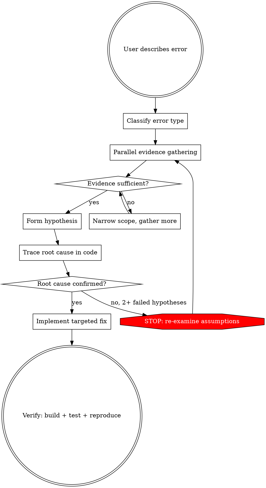

# Investigate and Fix

Systematic investigation and resolution of errors using all available diagnostic tools: Docker logs, MCP database queries, Playwright browser, code tracing, and the observability stack.

**Core principle:** Gather evidence from multiple sources IN PARALLEL before forming hypotheses. Never guess — investigate.

**REQUIRED BACKGROUND:** superpowers:systematic-debugging defines the root-cause methodology. This skill provides the platform-specific investigation toolkit.

## Investigation Flow



## Phase 1: Classify the Error

| Signal | Type | Primary investigation |
|--------|------|----------------------|
| Blank page, wrong UI, JS error | Frontend | Browser snapshot + console + network |
| 4xx/5xx from API | Backend | Service logs + handler code |
| Data missing or wrong | Data | Database query + handler code |
| Container won't start / 502 | Infrastructure | `docker compose ps` + container logs |
| Slow response / timeout | Performance | Traces (Tempo) + DB query plan |
| Test failure | Test | Test output + handler code |
| CORS / 301 redirect | Routing | Nginx logs + check trailing slash |

## Phase 2: Parallel Evidence Gathering

Dispatch multiple investigations simultaneously using subagents or parallel tool calls.

### A. Container Health (always check first)
```bash
docker compose ps                                    # All containers
docker compose logs --tail=150 <service> 2>&1        # Recent logs
docker compose logs --tail=100 --since=5m <service>  # Last 5 min
```

### B. Service Logs
```bash
# Search for errors in specific service
docker compose logs --tail=500 <service> 2>&1 | grep -iE "error|exception|fail|warn" | tail -50
# Full recent logs if grep isn't enough
docker compose logs --tail=200 <service>
```

### C. Database State (MCP `postgres` tools — fast, no CLI needed)
Schema-qualify tables explicitly when querying.

Useful diagnostic queries:
```sql
-- Recent records in a table
SELECT * FROM <table> ORDER BY created_at DESC LIMIT 10;
-- Wolverine message queue state (if async issue)
SELECT * FROM wolverine_incoming_envelopes ORDER BY id DESC LIMIT 10;
-- Check for orphaned FK references
SELECT * FROM <table> WHERE <fk_column> NOT IN (SELECT id FROM <ref_table>);
```

### D. Browser State (Playwright MCP — for frontend issues)
1. `browser_navigate` to `http://localhost/` (or relevant page)
2. `browser_snapshot` — current DOM tree
3. `browser_console_messages` — JS errors/warnings
4. `browser_network_requests` — failed API calls (look for 4xx/5xx)
5. `browser_take_screenshot` — visual state

### E. Observability — Grafana MCP (Loki + Tempo + Prometheus)

Two Grafana MCP servers can be configured: `grafana-local` (dev with observability up) and `grafana-prod` (prod via SSH tunnel). Use them **before** falling back to `docker logs` / raw curl.

**Investigation order:** Logs (Loki) → Traces (Tempo, by TraceId) → Metrics (Prometheus)

#### Loki labels (with Serilog + Alloy)

Alloy → Loki indexes:
- `compose_service` — Docker compose service name (e.g. `auth-service`, `web`)
- `service_name` — Loki auto-detect (usually the same value for .NET services)
- `level` — extracted from Serilog Console regex `[HH:MM:SS.fff XXX]` → full name: `Verbose|Debug|Information|Warning|Error|Fatal`. Only .NET services; postgres/nginx/redis don't have this label.
- `compose_project`, `cluster`, `container`, `logstream` (`stdout`/`stderr`).

For checking current values:
- `mcp__grafana-prod__list_loki_label_names`
- `mcp__grafana-prod__list_loki_label_values(label="level")`

#### LogQL — working templates (match `[HH:MM:SS.fff INF] [SourceContext] msg`)

```logql
# All errors of one service in the last hour
{compose_service="auth-service", level=~"Error|Fatal"}

# All Warning+Error in a window
{compose_service=~".*-service", level=~"Warning|Error|Fatal"}

# Text search (without specifying level — leave as tail filter)
{compose_service="my-service"} |= "BrokenCircuitException"

# Narrow by SourceContext (second `[]` group in the log)
{compose_service="my-service"} |~ "\\[MyService\\."

# Loki metric query (for dashboards)
sum by (compose_service) (count_over_time({level=~"Error|Fatal"}[5m]))
```

`mcp__grafana-prod__query_loki_logs(datasourceUid="loki", logql="...")` — instant or range. Default limit 10, max 100.

`mcp__grafana-prod__find_error_pattern_logs(...)` — auto-find recurring error patterns in a window.

#### PromQL — .NET / Postgres / Redis / RabbitMQ

```promql
# RED — RPS / errors / latency. Label `service_name` comes from OTel resource attribute (PascalCase: AuthService).
sum by (service_name) (rate(http_server_request_duration_seconds_count[5m]))
sum by (service_name) (rate(http_server_request_duration_seconds_count{http_response_status_code=~"5.."}[5m]))
histogram_quantile(0.95, sum by (le, service_name) (rate(http_server_request_duration_seconds_bucket[5m])))

# .NET runtime (new names from OTel SDK 1.10+, NO `process_runtime_dotnet_*` prefix)
dotnet_gc_last_collection_heap_size_bytes{service_name="AuthService"}
rate(dotnet_gc_collections_total[5m])
dotnet_thread_pool_thread_count_total
rate(dotnet_exceptions_total[5m])

# Postgres (postgres-exporter)
sum(pg_stat_database_numbackends)        # active connections
pg_settings_max_connections                # limit
pg_database_size_bytes{datname="my_db"}
sum(increase(pg_stat_database_deadlocks{datname="my_db"}[24h]))

# Redis (redis-exporter)
redis_memory_used_bytes
rate(redis_keyspace_hits_total[5m]) / clamp_min(rate(redis_keyspace_hits_total[5m]) + rate(redis_keyspace_misses_total[5m]), 1)
histogram_quantile(0.99, sum by (le, cmd) (rate(redis_commands_latencies_usec_bucket[5m]))) / 1000  # ms

# RabbitMQ (rabbitmq exporter at :15692)
sum by (queue) (rabbitmq_queue_messages_ready)
rabbitmq_queue_messages{queue="wolverine-dead-letter-queue"}                     # DLQ
count(rabbitmq_queue_consumers == 0 and rabbitmq_queue_messages_ready > 0) or vector(0)
```

`mcp__grafana-prod__query_prometheus(datasourceUid="prometheus", expr="...", queryType="instant"|"range", endTime="now")`.

Discovery: `mcp__grafana-prod__list_prometheus_metric_names`, `list_prometheus_label_values(name="service_name", metric="http_server_request_duration_seconds_count")`.

#### Tempo — TraceQL

```traceql
# Errored spans of a specific service
{ resource.service.name="MyService" && status=error }

# Slow requests (>1s)
{ resource.service.name=~".*Service" && span.kind=server && duration>1s }

# By HTTP route
{ span.http.route="/api/items/{id}" }

# By db.statement (Npgsql instrumentation)
{ span.db.statement=~".*SELECT.*from items.*" }
```

`mcp__grafana-prod__find_slow_requests` — auto-find slow traces in a window.

#### Why Grafana MCP over docker logs

- Structured LogQL/TraceQL/PromQL vs raw text grep
- Cross-service correlation by TraceId in one place
- Time-range filter, severity filter, JSON parsing built-in
- In prod: `docker logs` gives the tail of one container without history; Grafana — 14d retention with search

#### Fallback

If MCP unavailable (not wired up / observability not running):
```bash
# Prod — SSH + docker logs
ssh <user>@<host> 'docker logs --tail 200 <service> 2>&1 | grep -i error'

# Local without observability
docker compose logs --tail 200 <service> 2>&1 | grep -i error

# Raw Tempo trace lookup (local only)
curl -s "http://localhost:3200/api/traces/<traceId>" | jq '.batches[].scopeSpans[].spans[] | {name, status, attributes}'
```

### F. Nginx / Network
```bash
docker compose logs --tail=100 nginx 2>&1 | grep -E "502|503|504|405|301"
```
**Trailing slash rule:** All API routes in nginx require trailing `/`. Missing it causes 301 → CORS failure. Always check request URLs.

## Phase 3: Trace Root Cause in Code

Once you have the error message or stack trace:

1. **Grep for the error** — find where the message originates
2. **Read the handler** — understand the full request flow through vertical slice
3. **Check cross-service calls** — if the error involves another service, check `{Service}.Contracts/HttpCommunication/` for client code
4. **Check async messaging** — if the error is in an event handler, check `Shared/Messaging/RabbitMqMessaging/IntegrationEvents/` for routing and the Wolverine handler
5. **Check middleware pipeline** — auth, error handling, CORS in `{Service}.Web/`

### Where to Look
```
{Service}.Web/               → Endpoints, middleware, startup, DI
{Service}.Core/              → MediatR/Wolverine handlers, business logic, domain
{Service}.Contracts/         → DTOs, events, HTTP client interfaces
{Service}.Infrastructure.Postgres/ → DbContext, migrations, EF config
Shared/Authentication/       → JWT validation, auth schemes
Shared/Messaging/            → RabbitMQ integration events, routing
```

### Cross-Service Auth
All services validate JWTs via shared `Authentication` config. AuthService issues tokens. If 401/403:
- Check token claims (expired? wrong audience?)
- Check which auth scheme the endpoint expects (Cookie vs Bearer — AuthService gotcha)
- Check user roles in auth DB

## Phase 4: Fix and Verify

1. **Implement targeted fix** — single change addressing the root cause, no bundled refactoring
2. **Build:**
   ```bash
   cd backend && dotnet build backend.slnx
   ```
3. **Test affected service:**
   ```bash
   dotnet test backend/{Service}/tests/{Service}.IntegrationTests
   ```
4. **Frontend (if changed):**
   ```bash
   cd frontend && npm run build && npm run lint
   ```
5. **Reproduce original error** — confirm it no longer occurs (browser, API call, or test)

## Common Error Patterns

| Error | Likely Cause | First Check |
|-------|-------------|-------------|
| 401 Unauthorized | Token expired, wrong auth scheme | Auth logs, token claims, cookie vs bearer |
| 403 Forbidden | Missing role | User roles in auth DB |
| 404 Not Found | Wrong route, missing trailing `/` | Nginx logs, URL format |
| 500 Internal Server Error | Unhandled exception | Service logs (full stack trace) |
| 502 Bad Gateway | Service container down | `docker compose ps` |
| CORS error | 301 from missing trailing `/` | Request URL in browser network tab |
| Connection refused | Container not running or wrong port | Container health, port mapping |
| Timeout | Slow DB query, deadlock | Traces, `EXPLAIN ANALYZE` on query |
| RabbitMQ error | Queue missing, handler not registered | RabbitMQ mgmt UI (:15672), Wolverine config |
| EF migration error | Schema drift | Compare snapshot vs DB, re-run migration |
| NextAuth error | OIDC config mismatch | AuthService OIDC endpoints, frontend env vars |

## Red Flags — You're Guessing

- Changing code before reading logs
- Assuming error is in the service the user named (could be upstream)
- Ignoring cross-service communication
- Not checking container health first
- Fixing symptom without tracing to root cause
- Not querying the database when data looks wrong
- Skipping browser console/network when debugging frontend

## Parallel Subagent Strategy

For complex issues, dispatch parallel Explore/debugger agents:

| Agent | Task |
|-------|------|
| 1 | Container health + service logs (Bash) |
| 2 | Database state for relevant tables (MCP postgres) |
| 3 | Browser state — snapshot, console, network (Playwright MCP) |
| 4 | Codebase search for error message/pattern (Grep) |

Combine findings into a single evidence picture, THEN trace through code.
