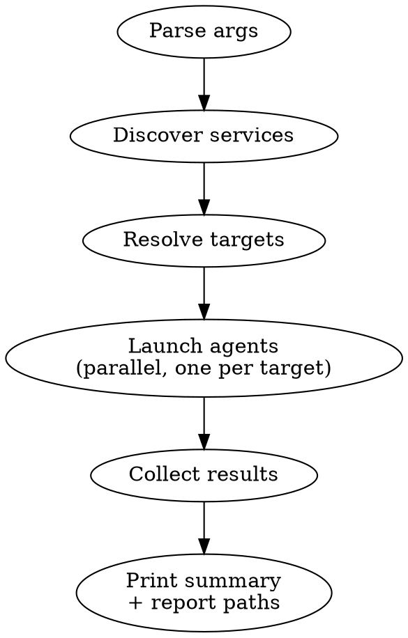

# Code Review

Deep review of backend .NET microservices and/or the Next.js frontend. Analyzes code against project conventions, security best practices, and architectural rules.

**Output: HTML report per target.** Each reviewing agent writes a structured `docs/reviews/YYYY-MM-DD-{Target}.json` (findings list, schema below), then renders it via the shared generator:

```bash
python3 ~/.claude/skills/_shared/render-report.py docs/reviews/YYYY-MM-DD-{Target}.json
# stdout = absolute path of rendered HTML — open in browser
```

In chat, the agent prints only an executive summary (top 3 blockers, counts by severity, HTML path). The full review lives in the browser with filters by severity/category/text search. Markdown dumps in chat are noise for any non-trivial review (>10 findings).

Severity vocabulary (use exactly these strings in JSON):
- `blocker` — must fix before merge (security holes, data loss, broken contracts)
- `high` — should fix before merge (architectural violations, N+1 on hot paths, missing entitlement checks)
- `medium` — fix this sprint (code quality, missing tests on non-critical paths)
- `low` — nice to have (style, docs, micro-perf)
- `info` — observation only, no action required

Required JSON fields per finding: `severity`, `category` (e.g. `security`, `architecture`, `database`, `performance`, `messaging`, `logging`, `tests`, `production`), `title`, `file`, `line`, `summary`, `recommendation`. Optional: `snippet`, `risk`. Full schema: `~/.claude/skills/_shared/render-report.py` docstring.

## Usage

```
/review-microservice ServiceName          # Review one backend service
/review-microservice frontend             # Review frontend
/review-microservice --all                # Review all backend services + frontend in parallel
/review-microservice --backend            # Review all backend services only
/review-microservice Svc1 Svc2 frontend   # Review specific targets
```

## Service Discovery

Do NOT hardcode a service list. Discover backend services dynamically. Some services use a flat layout (`backend/Foo/Foo.Web`), others a `src/` layout (`backend/Foo/src/Foo.Web`):

```bash
find backend -maxdepth 3 -type d -name "*.Web"
```

The service name is the second path segment (`backend/<Service>/...`). The service path is `backend/<Service>` — always pass this as `{ServicePath}` so the agent can locate sources regardless of `src/` layout.

Frontend path: `frontend/`.

## Workflow



## Execution

### Backend Service Review

For each backend service, launch a `microservice-reviewer` agent:

```
Agent(
  subagent_type: "microservice-reviewer",
  prompt: <see "Backend Agent Prompt" below>
)
```

### Frontend Review

For the frontend, launch a `code-reviewer` agent:

```
Agent(
  subagent_type: "code-reviewer",
  prompt: <see "Frontend Agent Prompt" below>
)
```

### Parallelism

Launch ALL target agents in a single message with multiple Agent tool calls, so reviews run concurrently. Do not wait for one review to finish before kicking off the next.

### After Agent(s) Complete

Print a summary table with HTML paths (the user opens these in the browser):

```
| Target                   | Blocker | High | Med | Low | Report                                          |
|--------------------------|---------|------|-----|-----|-------------------------------------------------|
| AuthService              | 1       | 4    | 7   | 2   | docs/reviews/2026-05-19-AuthService.html        |
| frontend                 | 0       | 3    | 5   | 4   | docs/reviews/2026-05-19-frontend.html           |
```

For each row, also list the top blocker (file:line + title) so the user can decide what to fix without opening the HTML. If `Blocker > 0`, flag the row for immediate attention.

## Selective Fix

After reviewing, the user can ask to fix specific items:
- "Fix all Critical issues in {Service}"
- "Fix WARNING #3 from the frontend review"

Read the report, find the referenced items, and apply fixes.

---

## Backend Agent Prompt

Include this full prompt when launching the microservice-reviewer agent for a backend service. Replace `{ServiceName}` and `{ServicePath}`:

~~~
Review {ServiceName}. Service path: {ServicePath}.

Read the project's CLAUDE.md, backend/CLAUDE.md, and the service's own CLAUDE.md (if it exists) before starting.

## Output

Write findings as JSON to `docs/reviews/YYYY-MM-DD-{ServiceName}.json` (one object, schema below), then render the HTML report:

```bash
python3 ~/.claude/skills/_shared/render-report.py docs/reviews/YYYY-MM-DD-{ServiceName}.json
# returns absolute HTML path on stdout — include in your reply
```

## JSON schema

```json
{
  "title": "{ServiceName} review",
  "scope": "{ServicePath}",
  "generatedAt": "<ISO 8601>",
  "findings": [
    {
      "id": "F-001",
      "severity": "blocker | high | medium | low | info",
      "category": "security | architecture | database | performance | messaging | logging | tests | production",
      "title": "<short imperative>",
      "file": "<relative path from repo root>",
      "line": <int, optional>,
      "summary": "<one paragraph: what + why>",
      "snippet": "<optional code excerpt>",
      "recommendation": "<concrete fix>",
      "risk": "low | medium | high (optional)"
    }
  ]
}
```

Severity mapping (use these exact strings — they drive the HTML report's filters and colors):
- `blocker` — must fix before merge (auth bypass, SQL injection, IDOR, data loss, schema break)
- `high` — should fix before merge (N+1 on hot path, missing entitlement check, broken outbox flush)
- `medium` — fix this sprint (Result/Error violation, missing Index, Russian-error-message violation)
- `low` — nice to have (style, naming, micro-perf)
- `info` — observation only, no action

Categories drive the filter chips — keep them in the closed set above. Group findings by setting `category` correctly; the HTML renders one chip per distinct value.

In chat, after the HTML is written, reply with:
1. Counts by severity (one line)
2. Top 3 blockers (file:line + title)
3. Absolute HTML path

## Review Checklist

Review EVERY item below. Report violations as findings. If a category has no issues, skip it in the report.

### 1. Security & Vulnerabilities

- [ ] SQL injection — All raw SQL (Dapper queries, migrationBuilder.Sql()) uses parameterized queries, never string interpolation/concatenation with user input
- [ ] Authorization on every endpoint — Every endpoint has .RequirePermissions(), .RequireAnyRole(), or .AllowAnonymous(). No unprotected endpoints that should be protected
- [ ] Permission constants — Uses named constants for permissions and roles, never hardcoded role/permission strings
- [ ] IDOR (Insecure Direct Object Reference) — Endpoints that operate on user-owned resources verify ownership (e.g., check userId from claims matches resource owner)
- [ ] Mass assignment — DTOs/commands don't expose fields that shouldn't be user-settable (e.g., Role, IsAdmin, CreatedBy)
- [ ] Secrets in code — No hardcoded passwords, API keys, connection strings, or tokens in source files
- [ ] Input validation — Every command/query has a FluentValidation validator. Validators check string lengths, ranges, required fields, format constraints
- [ ] File upload safety — File uploads validate content type, size limits, and file extension. No path traversal in file names
- [ ] Rate limiting — Auth-sensitive endpoints (login, OTP, password reset) have rate limiting or are behind one
- [ ] Content access on list/feed endpoints — List endpoints that DON'T call a per-item entitlement checker MUST filter by access level in SQL. Anonymous → only PUBLIC. Authenticated → PUBLIC + REGISTERED. Never include gated content without server-verified entitlement
- [ ] No client-supplied access IDs — Endpoints must NEVER accept enrollment/access IDs from query params to determine content access. Access must be resolved server-side
- [ ] Detail endpoints check entitlements — GET endpoints returning full gated content must call the entitlement checker. Admin bypasses automatically

### 2. Architecture & Code Structure

- [ ] Vertical slice pattern — Each use case file has Command/Query + Validator + Endpoint + Handler. No logic leaking between slices
- [ ] Clean Architecture layers — Domain has no infrastructure dependencies. Core defines interfaces, Infrastructure implements them. Web only does DI and pipeline config
- [ ] No business logic in endpoints — Endpoints only parse request, dispatch command/query, return result. No business decisions
- [ ] No business logic in DbContext/migrations — DbContext is for configuration only. Migrations are for schema changes only
- [ ] Repository pattern for data access — ALL database calls (EF Core and Dapper) during business operations MUST go through repository interfaces defined in Core and implemented in Infrastructure.Postgres. Handlers must NEVER directly use DbContext, IDbConnection, or call SQL. The only exception is TransactionManager/UnitOfWork patterns. This is a CRITICAL violation if broken
- [ ] No service-to-service DB access — Services access other services' data only via HTTP clients (Contracts), never by querying another service's schema directly
- [ ] DI registration — Each layer has a single Registration.cs / DependencyInjectionExtensions.cs. No service registration scattered across files
- [ ] Domain entity encapsulation — Entities use private constructors + static Create() factories returning Result<T, Error>. No public setters for invariant-protected properties. State changes through methods that validate and return Result

### 3. Database & Data Access

- [ ] Repository interface in Core — Every repository has an interface in Core (IXxxRepository) and implementation in Infrastructure.Postgres
- [ ] CQRS compliance — Writes go through EF Core (via repositories), complex reads via Dapper (via read-only query services/repositories). No mixing within a single operation
- [ ] Guid.CreateVersion7() — Production code uses Guid.CreateVersion7(), not Guid.NewGuid() (tests are exempt)
- [ ] Snake_case columns — Custom tables/columns use snake_case. Identity tables use PascalCase with double-quotes in Dapper
- [ ] Missing indexes — Frequently queried columns (foreign keys, status fields, lookup fields) have appropriate indexes
- [ ] N+1 queries — No loops that execute a query per iteration. Use batch fetching, joins, or Include()
- [ ] Unbounded queries — All list queries have pagination (skip/take or cursor-based). No ToListAsync() without limits on potentially large tables
- [ ] Connection/transaction management — No manual connection opening/closing. Let EF Core manage connections. Transactions scoped properly via TransactionManager
- [ ] Migration immutability — Existing migrations are not modified or deleted. New migrations only add, never remove columns/tables without a migration plan

### 4. Performance & Optimization

- [ ] Caching where appropriate — Frequently accessed, rarely changing data uses HybridCache (Redis + local). Cache invalidation is correct
- [ ] Cross-service cached client sync — If `IXxxServiceClient` has methods not in the corresponding `CachedXxxServiceClient`, flag it
- [ ] Async all the way — No .Result, .Wait(), .GetAwaiter().GetResult() on async calls (deadlock risk). No sync-over-async
- [ ] Streaming for large data — File downloads/uploads use streaming, not loading entire content into memory
- [ ] Select only needed columns — Dapper queries select specific columns, not SELECT *. EF Core uses .Select() projections where appropriate
- [ ] Unnecessary allocations — No repeated string concatenation in loops (use StringBuilder). No LINQ chains that materialize multiple times
- [ ] GET query optimization — Read endpoints use const string SQL (not interpolated strings) for Npgsql query plan caching. Complex queries with conditional WHERE/ORDER use pre-built const variants, not runtime string building

### 5. Messaging & Integration

- [ ] Outbox pattern — Integration events published via OutboxService.PublishAsync() within the same transaction as the domain change. No direct RabbitMQ publishing
- [ ] Routing key conventions — Keys follow {entity}.{action}[.{target}] pattern. Match conventions in MESSAGING_CONVENTIONS.md
- [ ] Idempotent consumers — Message handlers are idempotent (safe to replay). Use deduplication or upsert logic
- [ ] No domain events from integration handlers — Integration event handlers don't raise domain events (wrong transaction context)
- [ ] Wolverine transport isolation in tests — Tests call DisableAllExternalWolverineTransports() and create Wolverine schema tables

### 6. Error Handling & Logging

- [ ] Result pattern everywhere — Business operations return Result<T, Error> or UnitResult<Error>. No throw for expected business errors. Exceptions only for truly unexpected failures
- [ ] User-facing error messages — Error message field is in the user's language (e.g. Russian). Error code field is dot-separated lowercase English
- [ ] Structured logging — Uses ILogger<T> with structured parameters {ParamName}, not string interpolation. Log levels appropriate (Information for business events, Warning for recoverable issues, Error for failures)
- [ ] No swallowed exceptions — Catch blocks either log + rethrow, log + return error, or handle meaningfully. No empty catch blocks
- [ ] Sensitive data not logged — No logging of passwords, tokens, full credit card numbers, or PII beyond what's necessary

### 7. Test Coverage

- [ ] Integration tests exist — Every public endpoint / major use case has at least one integration test
- [ ] Test isolation — Each test resets DB via Respawn. No test-to-test dependencies or ordering assumptions
- [ ] Auth testing — Tests cover both authorized and unauthorized access. Tests use AuthenticateAs() helper
- [ ] Edge cases — Tests cover not just happy path but validation failures, not-found, unauthorized, concurrent access where relevant
- [ ] Testcontainers setup — Tests use real PostgreSQL via Testcontainers, not in-memory DB or mocks for data access

### 8. Production Readiness

- [ ] Health checks — Service has health check endpoints for DB and external dependencies
- [ ] Configuration — Secrets via env vars / secret manager, non-secrets in appsettings. No hardcoded config
- [ ] Docker — Dockerfile follows conventions (healthcheck via dotnet healthcheck/healthcheck.dll, multi-stage build)
- [ ] OpenAPI — All endpoints have proper OpenAPI metadata (tags, response types)
- [ ] Observability — OTEL tracing configured. Important operations have custom spans/metrics where needed
~~~

## Frontend Agent Prompt

Include this full prompt when launching the code-reviewer agent for the frontend:

~~~
Review the Next.js frontend. Path: frontend/.

Read frontend/CLAUDE.md and the project root CLAUDE.md before starting.

## Output

Write findings as JSON to `docs/reviews/YYYY-MM-DD-frontend.json`, then render the HTML report:

```bash
python3 ~/.claude/skills/_shared/render-report.py docs/reviews/YYYY-MM-DD-frontend.json
```

## JSON schema

```json
{
  "title": "Frontend review",
  "scope": "frontend/",
  "generatedAt": "<ISO 8601>",
  "findings": [
    {
      "id": "F-001",
      "severity": "blocker | high | medium | low | info",
      "category": "security | architecture | performance | code-quality | ux | auth | tests | production",
      "title": "<short imperative>",
      "file": "<relative path from repo root>",
      "line": <int, optional>,
      "summary": "<one paragraph>",
      "snippet": "<optional code excerpt>",
      "recommendation": "<concrete fix>",
      "risk": "low | medium | high (optional)"
    }
  ]
}
```

Severity vocabulary matches the backend prompt: `blocker | high | medium | low | info`. FSD layer-hierarchy violations and upward imports = `blocker` (mechanically prevented by ESLint, so any occurrence means a rule was bypassed or freshly broken). Manual memoization (`useCallback` / `useMemo` / `React.memo`) under React Compiler 19 = `blocker` — it actively confuses the compiler.

In chat after the HTML is written, reply with:
1. Counts by severity (one line)
2. Top 3 blockers (file:line + title)
3. Absolute HTML path

## Review Checklist

Review EVERY item below. Report violations as findings. If a category has no issues, skip it.

### 1. Security & Vulnerabilities

- [ ] XSS — No unsanitized user input rendered as raw HTML. Markdown rendering uses a safe renderer with sanitization
- [ ] Token exposure — Auth tokens not stored in localStorage. No tokens in URLs or logs
- [ ] CSRF — Forms use proper CSRF protection where needed
- [ ] Sensitive data in client bundle — No secrets, API keys, or internal URLs in NEXT_PUBLIC_* vars that shouldn't be public
- [ ] Open redirects — Login/callback redirect URLs are validated against allowlist, not taken raw from query params
- [ ] Dependency vulnerabilities — No known vulnerable packages (check if npm audit has critical issues)

### 2. Architecture (FSD Compliance)

- [ ] Layer hierarchy — Imports only go downward: app -> widgets -> features -> entities -> shared. No upward imports. CRITICAL if broken
- [ ] No cross-slice imports — features/A never imports from features/B. entities/A never imports from entities/B. Shared logic lives in entities or shared
- [ ] Public API via index.ts — External consumers import from slice barrel (entities/{entity}), not internal files (entities/{entity}/api.ts)
- [ ] Route layout structure — Pages use composition/slot pattern. Layouts don't import feature components directly
- [ ] Entity layer pattern — Each entity has api.ts (query options factories), types.ts, index.ts. API methods return typed Envelope responses
- [ ] Mutation hooks — One file per mutation: use-{action}-{entity}.ts in the feature's model/ directory. Mutation hooks handle toast + cache invalidation

### 3. Performance & Optimization

- [ ] No manual memoization — React Compiler is enabled: no useCallback, useMemo, React.memo. CRITICAL if used (confuses the compiler)
- [ ] No object/array mutation — Always return new references, never mutate in place (breaks React Compiler assumptions)
- [ ] Bundle size — No large libraries imported in client components that should be code-split. Heavy components use dynamic() or React.lazy()
- [ ] Image optimization — Uses next/image for images, not raw img tags. Proper width/height or fill mode
- [ ] Query optimization — React Query stale times are appropriate. No redundant refetches. Proper use of queryKey for cache isolation
- [ ] Unbounded lists — Lists with potentially many items use pagination or virtualization, not render-all

### 4. Code Quality & Patterns

- [ ] Route constants — All routes use routes.* from shared/config/routes.ts, never hardcoded path strings
- [ ] Trailing slashes in API URLs — All API URLs include trailing slash (nginx 301 without it breaks CORS)
- [ ] Error display — Uses getErrorMessage(error, "fallback"), never raw error.message
- [ ] Toast style — Success: short, no "successfully". Error: "Error {action}". Past-participle style.
- [ ] Consistent naming — Files: kebab-case. Components: PascalCase. Hooks: use-{name}.ts. Types: PascalCase
- [ ] No dead code — No unused imports, components, hooks, or commented-out code blocks
- [ ] TypeScript strictness — No any types, no @ts-ignore without justification, no type assertions (as) where proper typing is possible

### 5. Error Handling & UX

- [ ] Loading states — Async operations show loading indicators. Pages use loading.tsx Suspense boundaries
- [ ] Error boundaries — Route segments have error.tsx for graceful error recovery
- [ ] Form validation — Forms use react-hook-form + Zod. Server errors mapped via setServerErrors()
- [ ] Optimistic updates — Where appropriate, mutations use optimistic updates with rollback
- [ ] Empty states — Lists handle empty state with a meaningful message, not just blank space

### 6. Auth & Access Control

- [ ] Protected routes — Middleware redirects unauthenticated users. No auth-required pages accessible without login
- [ ] Role-based UI — Uses Can component or useRoles() hook. No hardcoded role checks with string literals
- [ ] Token sync — TokenSync runs before SessionGuard and authenticated queries. No race conditions
- [ ] Session handling — Proper logout clears all state. Session expiry redirects to login
- [ ] Feed components filter by access level — Frontend feed/list components should not display content the user cannot access. If the backend returns only accessible items, verify the API params don't leak private content
- [ ] No client-side access decisions — Access decisions (can user see this content?) must come from the backend, not frontend-only checks. Frontend only controls UI visibility based on backend-provided flags

### 7. Test Coverage

- [ ] Unit tests exist — Critical utilities, hooks, and business logic have Vitest tests
- [ ] Component tests — Key interactive components have render tests
- [ ] API mocking — Tests mock API calls properly, not implementation details

### 8. Production Readiness

- [ ] Build succeeds — npm run build passes without errors
- [ ] Lint clean — npm run lint has no errors
- [ ] Environment config — All env vars documented. No missing NEXT_PUBLIC_* in production
- [ ] Hydration safety — No client-only APIs (window, localStorage) accessed during SSR without guards
- [ ] Middleware — Auth middleware covers all protected routes. Public routes are explicitly excluded
~~~
